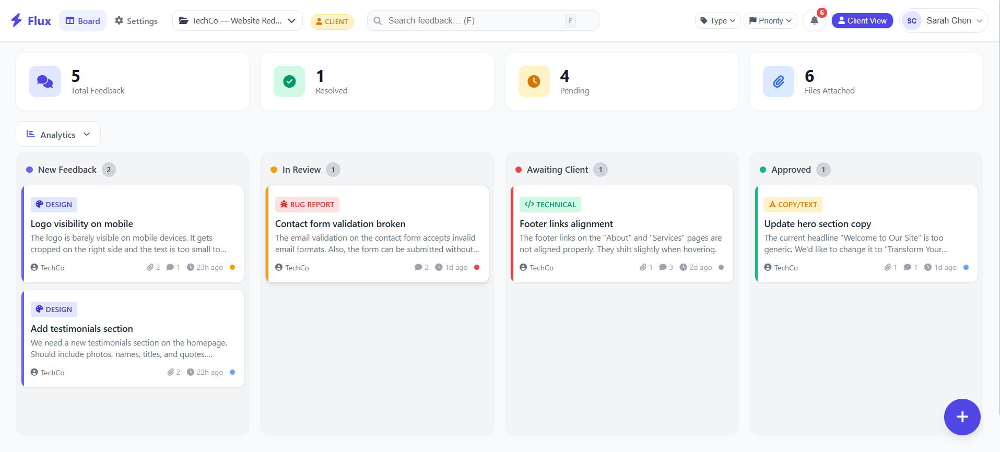

# ⚡ Flux — Client-Agency Feedback Portal

A production-style SaaS feedback management platform built entirely with
**vanilla JavaScript, HTML, and CSS** — no frameworks, no build tools,
no dependencies.

Flux enables agencies to collect, discuss, and resolve client feedback
through a Kanban workflow system with role-based access control.



---

## 🔴 Live Demo

**[→ View Live Demo](https://kingmiguelito-golteb.github.io/flux/)**

Create your own account to explore the full platform:

1. Click **"Create Free Account"** on the landing page
2. Fill in your details and choose a role:
   - **Client** — submit feedback, comment, track progress
   - **Agency** — full access with drag-and-drop, bulk actions, project management
3. Your dashboard will be pre-populated with sample feedback to get you started

> 💡 All data is stored in your browser's localStorage. Nothing is sent to any server.

## ✨ Key Features

### For Clients
- Submit structured feedback with type, priority, and file attachments
- Track feedback status through the Kanban board
- Comment and discuss with the agency team
- Receive notifications on status changes

### For Agencies
- Drag-and-drop Kanban board (New → In Review → Awaiting → Approved)
- Bulk actions: approve, delete, convert to tasks
- Task conversion with assignee and deadline
- Full project management
- Analytics dashboard with resolution metrics

### Architecture Highlights
- **Role-Based Access Control** enforced at UI, event, and API layers
- **API abstraction layer** — localStorage today, REST API tomorrow
- **Multi-page SaaS structure** — landing, auth, dashboard, projects, settings
- **Zero dependencies** — no React, no jQuery, no Bootstrap
- **Responsive design** — works on desktop, tablet, and mobile

---

## 🏗️ Tech Stack

| Layer | Technology |
|-------|-----------|
| Structure | Semantic HTML5 |
| Styling | CSS3 with custom properties (design system) |
| Logic | Vanilla JavaScript (ES5+ compatible) |
| Icons | Font Awesome 6 |
| Persistence | localStorage with API abstraction |
| Deployment | GitHub Pages |

---

## 📁 Project Structure
flux/
├── index.html # Smart redirect (auth check)
├── landing.html # Marketing / landing page
├── login.html # Authentication
├── signup.html # Registration
├── dashboard.html # Main Kanban feedback board
├── projects.html # Project management
├── account.html # User settings & preferences
│
├── css/
│ ├── common.css # Design system & shared components
│ ├── styles.css # Dashboard & Kanban styles
│ ├── landing.css # Landing page styles
│ ├── auth.css # Login & signup styles
│ ├── account.css # Account settings styles
│ └── projects.css # Project management styles
│
├── js/
│ ├── core/
│ │ ├── storage.js # localStorage wrapper with namespacing
│ │ └── api.js # Data access layer with RBAC enforcement
│ │
│ ├── ui/
│ │ ├── splash.js # Loading screen
│ │ ├── toast.js # Notification toasts
│ │ ├── nav.js # Shared navigation & user menu
│ │ └── notifications.js # Bell icon notification center
│ │
│ ├── pages/
│ │ ├── login.js # Login page logic
│ │ ├── signup.js # Registration with validation
│ │ ├── account.js # Settings & profile management
│ │ └── projects.js # Project CRUD operations
│ │
│ └── app.js # Dashboard controller (board, modals, analytics)
│
├── screenshots/ # README images
└── README.md

text


---

## 🔐 Role-Based Access Control

Permissions are enforced at **three layers** to prevent bypassing:

| Action | Client | Agency |
|--------|:------:|:------:|
| View feedback board | ✅ | ✅ |
| Submit feedback | ✅ | ✅ |
| Post comments | ✅ | ✅ |
| Search & filter | ✅ | ✅ |
| Drag-and-drop cards | ❌ | ✅ |
| Change feedback status | ❌ | ✅ |
| Bulk approve / delete | ❌ | ✅ |
| Convert to tasks | ❌ | ✅ |
| Manage projects | ❌ | ✅ |
| Switch to Agency view | ❌ | ✅ |
Layer 1: UI → .agency-only CSS class hides restricted elements
Layer 2: Events → JavaScript guards block restricted actions
Layer 3: API → _requireRole() rejects unauthorized operations

text


---

## 🚀 Getting Started

```bash
# Clone the repository
git clone https://github.com/KingMiguelito-golteb/flux.git
cd flux

# No build step — just serve the files
npx serve .
# or
python -m http.server 8000
# or just open index.html in your browser
📸 Screenshots
<details> <summary>Click to expand screenshots</summary>
Landing Page
Landing

Login
Login

Dashboard — Agency View
Dashboard Agency

Dashboard — Client View
Dashboard Client

Feedback Detail with Activity Timeline
Detail

Analytics Panel
Analytics

Projects Management
Projects

Account Settings
Account

Mobile Responsive
Mobile

</details>
🎯 Design Decisions
Why vanilla JavaScript instead of React/Vue?

To demonstrate deep understanding of the web platform fundamentals.
Any developer can install a framework — fewer can architect a clean
multi-page application with modular vanilla JS, proper state management,
and three-layer RBAC without any dependencies.

Why localStorage instead of a real backend?

The FluxAPI module is designed as an abstraction layer. Every function
returns a Promise and follows REST-like conventions. Replacing localStorage
with fetch() calls to a real API requires changing only the function
bodies — all consumers remain untouched.

Why multi-page instead of SPA?

Each page loads only the JavaScript it needs. No client-side router,
no bundle splitting configuration, no hydration issues. The browser's
native navigation handles page transitions. The landing page gets
zero JavaScript overhead from the dashboard.

🗺️ Future Roadmap
 Node.js + Express backend with PostgreSQL
 Real-time updates via WebSocket
 Image annotation (click-to-comment on screenshots)
 Email notifications via SendGrid
 PDF export of feedback reports
 Dark mode theme toggle
 WCAG 2.1 AA accessibility audit
 End-to-end tests with Playwright
 Docker containerization
📄 License
MIT License — Built by KingMiguelito-golteb

This project was built from scratch as a portfolio piece to demonstrate
full-stack product thinking, clean architecture, and production-quality
frontend engineering without framework dependencies.

text


---

## Quick Verification

After updating all the `<head>` tags, verify each file has exactly this order of elements in `<head>`:
<meta charset="UTF-8">
<link rel="icon" ...> ← favicon
<meta name="viewport" ...>
<title>...</title>
<meta name="description" ...>
<meta property="og:..." ...> ← Open Graph tags
<meta name="twitter:..." ...> ← Twitter cards (landing only)
<link rel="stylesheet" ...> ← CSS files
<link ... font-awesome ...> ← Icons