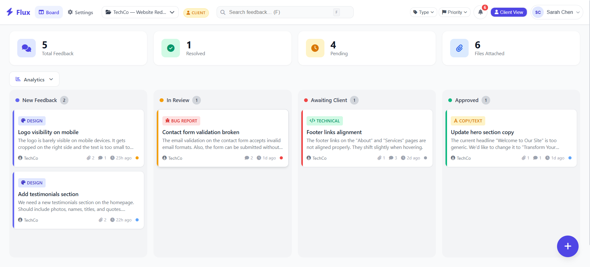
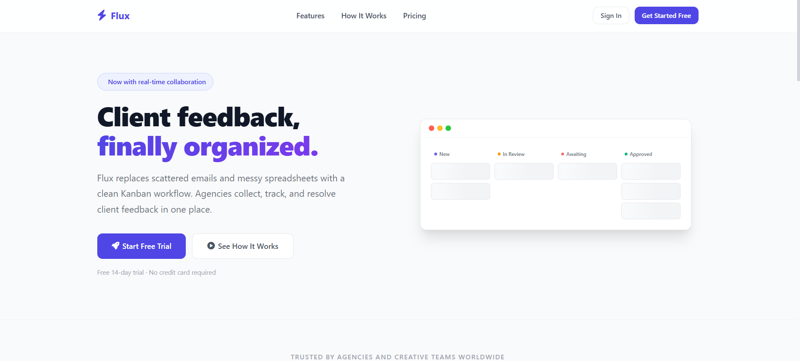
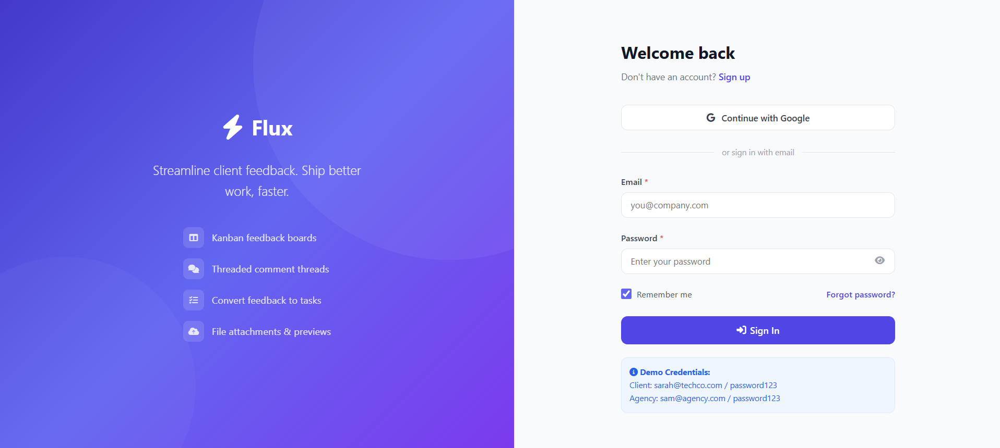
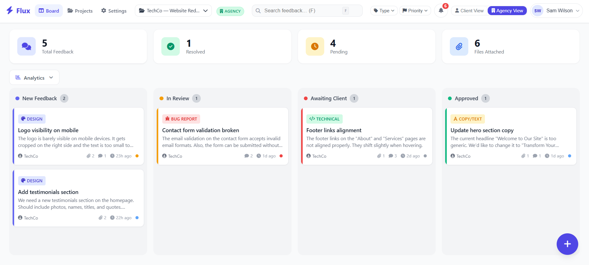
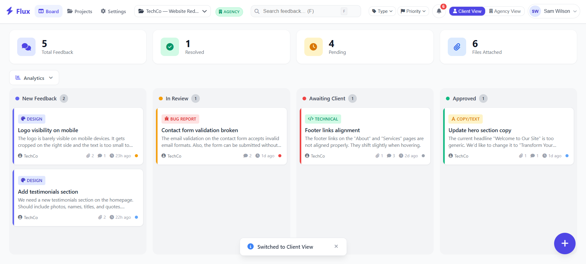
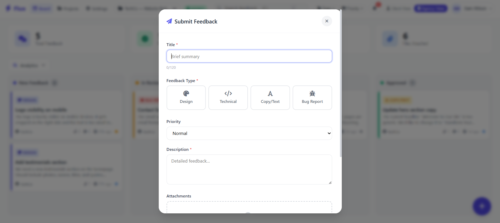
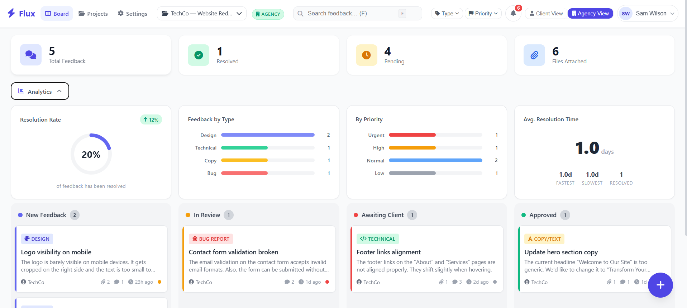
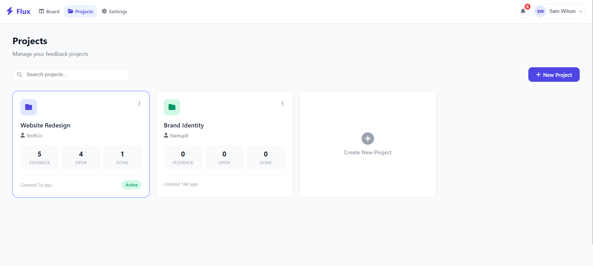
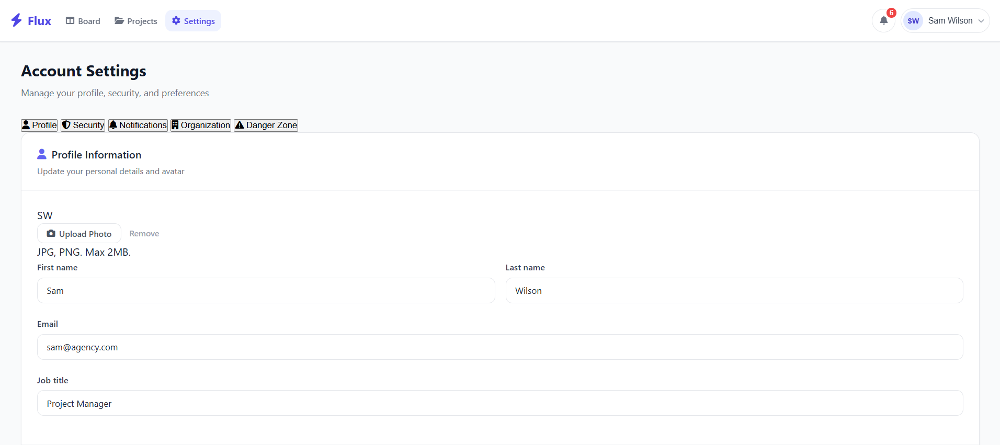
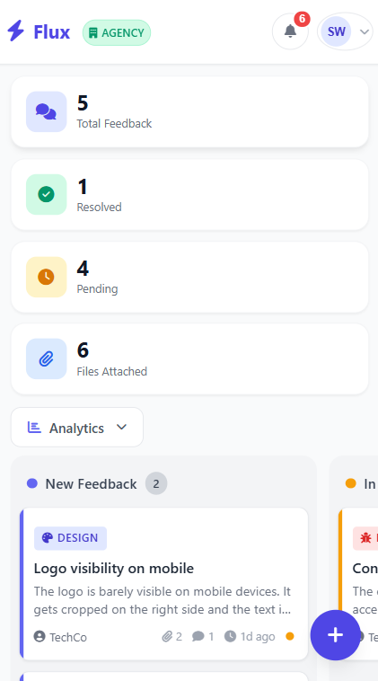

# ⚡ Flux — Client-Agency Feedback Portal

A production-style SaaS feedback management platform built entirely with
**vanilla JavaScript, HTML, and CSS** — no frameworks, no build tools, no dependencies.

Flux enables agencies to collect, discuss, and resolve client feedback through a
Kanban workflow with role-based access control.



---

## 🔴 Live Demo

**[→ View Live Demo](https://flux1-portal.vercel.app/)**

### Try it instantly

On the sign-in page, choose one of the **one-click demo accounts**:

| Account | What you get |
|---------|--------------|
| **Client** | Submit feedback, comment, and track progress |
| **Agency** | Everything above, plus drag-and-drop, bulk actions, and project management |

Both demo accounts come pre-loaded with 3 projects, 11 feedback items across all
four board columns, threaded comments, and notification history — so the product
looks alive the moment you land on it.

Prefer to start clean? **Create Free Account** on the landing page also works and
seeds a small starter project.

> 💡 All data is stored in your browser's `localStorage`. Nothing is sent to any server.
> Clearing site data resets the demo completely.

---

## ✨ Key Features

### For Clients
- Submit structured feedback with type, priority, and file attachments
- Track feedback status through the Kanban board
- Comment and discuss with the agency team
- Receive notifications on status changes

### For Agencies
- Drag-and-drop Kanban board (New → In Review → Awaiting → Approved)
- Bulk actions: approve, delete, convert to tasks
- Task conversion with assignee and deadline
- Full project management
- Analytics dashboard with resolution metrics

### Architecture Highlights
- **Role-Based Access Control** enforced at UI, event, and API layers
- **API abstraction layer** — localStorage today, REST API tomorrow
- **Multi-page SaaS structure** — landing, auth, dashboard, projects, settings
- **Zero dependencies** — no React, no jQuery, no Bootstrap
- **Responsive design** — works on desktop, tablet, and mobile
- **Accessible by default** — skip links, visible focus states, ARIA menu state,
  Escape-to-close dropdowns, and `prefers-reduced-motion` support

---

## 🏗️ Tech Stack

| Layer | Technology |
|-------|-----------|
| Structure | Semantic HTML5 |
| Styling | CSS3 with custom properties (design system) |
| Logic | Vanilla JavaScript (ES5+ compatible) |
| Icons | Font Awesome 6 |
| Persistence | localStorage with API abstraction |
| Deployment | Vercel (static) |

---

## 📁 Project Structure

```text
flux/
├── index.html          # Smart redirect (auth check)
├── landing.html        # Marketing / landing page
├── login.html          # Authentication + demo accounts
├── signup.html         # Registration
├── dashboard.html      # Main Kanban feedback board
├── projects.html       # Project management
├── account.html        # User settings & preferences
├── 404.html            # Branded not-found page
│
├── css/
│   ├── common.css      # Design system, shared components, a11y baseline
│   ├── styles.css      # Dashboard & Kanban styles
│   ├── landing.css     # Landing page styles
│   ├── auth.css        # Login & signup styles
│   ├── account.css     # Account settings styles
│   └── projects.css    # Project management styles
│
├── js/
│   ├── core/
│   │   ├── storage.js  # localStorage wrapper with namespacing
│   │   ├── api.js      # Data access layer with RBAC enforcement
│   │   └── demo.js     # Seeded demo accounts and sample dataset
│   │
│   ├── ui/
│   │   ├── splash.js   # Loading screen (with failsafe)
│   │   ├── toast.js    # Notification toasts
│   │   ├── nav.js      # Shared navigation & user menu
│   │   └── notifications.js  # Bell icon notification center
│   │
│   ├── pages/
│   │   ├── login.js    # Login page logic
│   │   ├── signup.js   # Registration with validation
│   │   ├── account.js  # Settings, profile, scroll-spy sidebar
│   │   └── projects.js # Project CRUD operations
│   │
│   └── app.js          # Dashboard controller (board, modals, analytics)
│
├── screenshots/        # README images
├── vercel.json         # Deployment config (clean URLs, security headers)
├── robots.txt
└── sitemap.xml
```

---

## 🔐 Role-Based Access Control

Permissions are enforced at **three layers** to prevent bypassing:

| Action | Client | Agency |
|--------|:------:|:------:|
| View feedback board | ✅ | ✅ |
| Submit feedback | ✅ | ✅ |
| Post comments | ✅ | ✅ |
| Search & filter | ✅ | ✅ |
| Drag-and-drop cards | ❌ | ✅ |
| Change feedback status | ❌ | ✅ |
| Bulk approve / delete | ❌ | ✅ |
| Convert to tasks | ❌ | ✅ |
| Manage projects | ❌ | ✅ |
| Switch to Agency view | ❌ | ✅ |

```text
Layer 1: UI     → .agency-only CSS class hides restricted elements
Layer 2: Events → JavaScript guards block restricted actions
Layer 3: API    → _requireRole() rejects unauthorized operations
```

Privilege escalation is blocked too: a client who edits the role dropdown in
Settings is refused by the API layer and shown an explanatory toast.

---

## 🚀 Getting Started

```bash
# Clone the repository
git clone https://github.com/KingMiguelito-golteb/flux.git
cd flux

# No build step — just serve the files
npx serve .
# or
python3 -m http.server 8000
```

Then open <http://localhost:8000>.

> Serve over HTTP rather than opening `index.html` directly — the `file://`
> protocol applies stricter origin rules to `localStorage`.

---

## ▲ Deploying to Vercel

This is a pure static site, so deployment needs no build configuration.

**Via the dashboard**

1. Push this repository to GitHub.
2. In Vercel, choose **Add New → Project** and import the repo.
3. Framework Preset: **Other**. Leave Build Command empty and set
   Output Directory to `./` (the repo root).
4. Click **Deploy**.

**Via the CLI**

```bash
npm i -g vercel
vercel          # preview deployment
vercel --prod   # production deployment
```

`vercel.json` already sets clean URLs (`/login` instead of `/login.html`),
sensible cache headers, and security headers such as `X-Content-Type-Options`
and `Referrer-Policy`.

After your first deploy, update the canonical and Open Graph URLs if your
production domain differs from the one committed here:

```bash
grep -rl "flux1-portal.vercel.app" . --include=*.html --include=*.xml --include=*.txt
```

---

## 📸 Screenshots

<details>
<summary>Click to expand screenshots</summary>

**Landing Page**



**Login**



**Dashboard — Agency View**



**Dashboard — Client View**



**Feedback Detail with Activity Timeline**



**Analytics Panel**



**Projects Management**



**Account Settings**



**Mobile Responsive**



</details>

---

## 🎯 Design Decisions

**Why vanilla JavaScript instead of React/Vue?**

To demonstrate deep understanding of the web platform fundamentals. Any developer
can install a framework — fewer can architect a clean multi-page application with
modular vanilla JS, proper state management, and three-layer RBAC without any
dependencies.

**Why localStorage instead of a real backend?**

The `FluxAPI` module is designed as an abstraction layer. Every function returns a
Promise and follows REST-like conventions. Replacing localStorage with `fetch()`
calls to a real API requires changing only the function bodies — all consumers
remain untouched.

**Why multi-page instead of SPA?**

Each page loads only the JavaScript it needs. No client-side router, no bundle
splitting configuration, no hydration issues. The browser's native navigation
handles page transitions, and the landing page carries zero dashboard overhead.

**Why no "Continue with Google" button?**

An earlier version had one as a non-functional placeholder. A fake federated
sign-in control sitting next to a password field is a well-known phishing
heuristic, and it caused browser safe-browsing interstitials on the deployed
site. It has been replaced with genuine one-click demo accounts, which are both
safer and more useful to a reviewer.

---

## 🗺️ Future Roadmap

- [ ] Node.js + Express backend with PostgreSQL
- [ ] Real-time updates via WebSocket
- [ ] Image annotation (click-to-comment on screenshots)
- [ ] Email notifications via SendGrid
- [ ] PDF export of feedback reports
- [ ] Dark mode theme toggle
- [ ] Full WCAG 2.1 AA accessibility audit
- [ ] End-to-end tests with Playwright

---

## 📄 License

MIT License — built by [KingMiguelito-golteb](https://github.com/KingMiguelito-golteb).

This project was built from scratch as a portfolio piece to demonstrate product
thinking, clean architecture, and production-quality frontend engineering without
framework dependencies.
